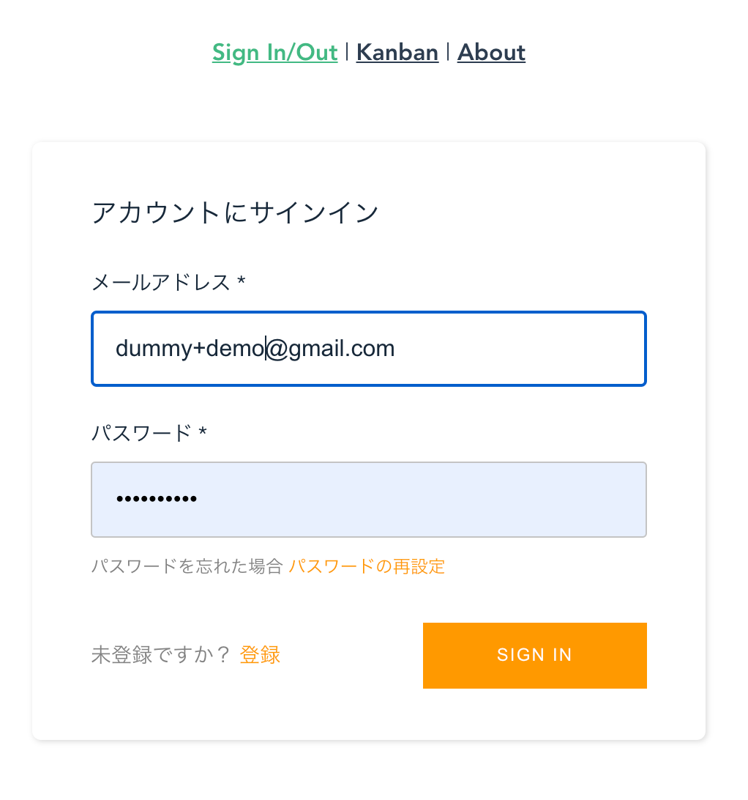
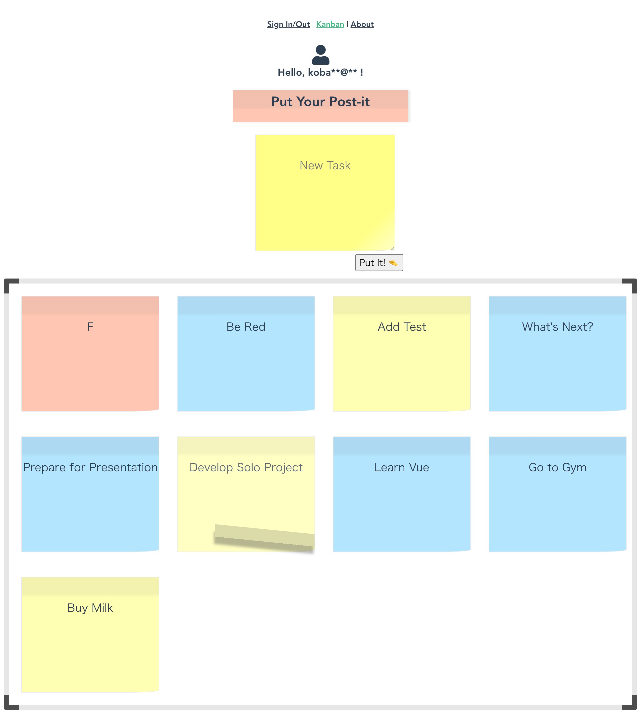
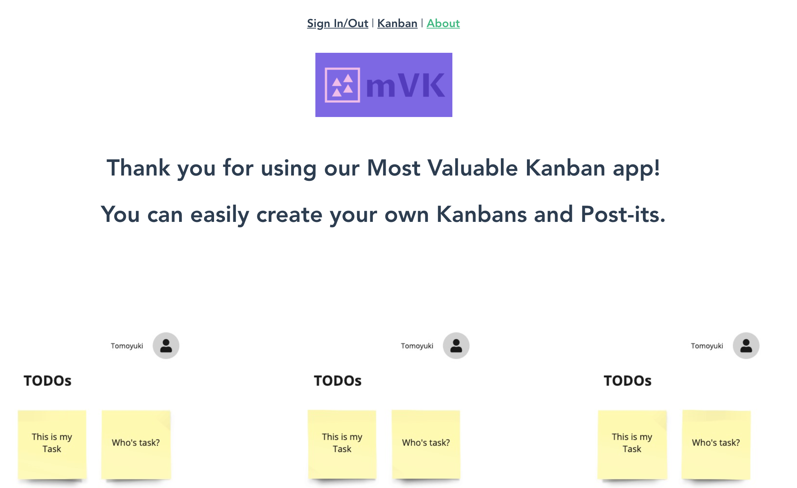
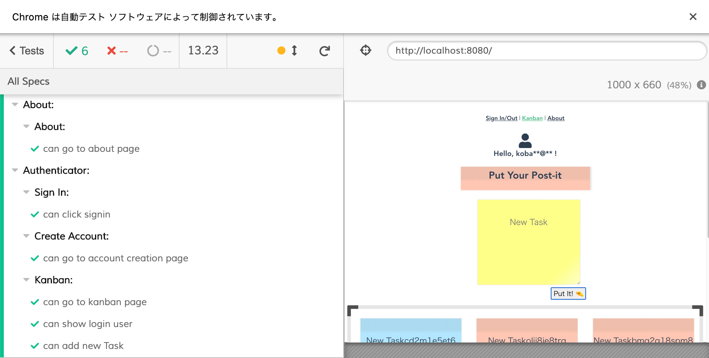

# Solo Fullstack Project - mVK Kanban


This was created during my time as a student at "Code Chrysalis”.

This is the project to learn fullstack development.

## User Story
- as a software developer, I want to create kanban for task management
- as a software development team, we want to add post-its to Kanban, multiple members at the same time
- as a software development team, we want to be able to easily operate post-it from my smartphone when we all operate it.

## Futures

- [x] User Registeration
- [x] User Authentication
- [ ] 1-N Kanbans per user
    - Currently, 1 Kanban per user
- [x] Put/Remove Post-it to Kanban
- [ ] Team collaboration on the same Kanban

## Mock Design
I envisioned a design that could be easily operated with one hand from a smartphone during a meeting.


## Actual Design
Now this app consists of three screens. Selecting the navigation links at the top will take you to each screen.

### Auth
This is the screen for user registration and authentication. You can use Kanban after the authentication is completed.
※ This screen is the same as the AWS Amplify sample authentication screen.


### Kanban
On the Kanban screen, you can add or remove Post-its from the Kanban of the authenticated user.


### About
Explanation screen of this application.


## Architecture
This service is built using AWS Amplify for both the front and back end. Front and back are connected via GraphQL, and when mutations occurred, frontn is notified by Back via GraphQL subscription and the screen is updated.


- AWS Amplify
    - AppSync
    - Lambda
    - DynamoDB
    - SNS
    - CloudWatch
    - CodePipeline
    - CloudFormation

## Setup

### Verified Environment
- node v12.x
- yarn 1.22.x

- Mac OSX Catalina (10.15.x)
- AWS Amplify

### Setup Amplify

This application is really depend on AWS Amplify, so you need to set up Amplify first.

#### install amplify command

```
yarn global add @aws-amplify/cli
```

#### configure

```
amplify configure
```

#### initalize amplify project

```
amplify init
```

#### add auth(congito) to amplify

```
amplify add auth
```

#### add graphql backend endpoint to amplify

```
amplify add api
```

#### update amplify

```
amplify push
```

#### delete amplify backend
```
amplify delete
```

### Build Commands

### Install dependencies
```
yarn install
```

### Compiles and hot-reloads for development
```
yarn serve
```

### Compiles and minifies for production
```
yarn build
```

### Lints and fixes files
```
yarn lint
```

### Run Unit Test
```
yarn test
```

### Run E2E Test (Cypress)

CUI mode

You can run E2E test on Cypress CUI. After test executed, caputure movie is created in cypress/videos.

```
yarn e2e:cui
```

GUI mode

You can run E2E test on Cypress GUI.

```
yarn e2e:gui
```



## TODOs
- [x] Implement MVP
    - [x] Authentication
        - [x] Register User with Email
        - [x] Show Login User Email
    - [ ] Basic Kanban Feature
        - [x] List Post-it
        - [x] Put Post-it
        - [x] Remove Post-it
        - [ ] Move Post-it
        - [ ] Create Kanban lane
        - [ ] Remove Kanban lane
    - [ ] Collaborative Kanban
        - [ ] Can see same Kanban
        - [ ] Can modify same Kanban
- [ ] Test
    - [ ] Unit
    - [x] E2E
- [ ] Use CSS Pre-Poccessor
- [x] CI/CD
    - [x] Deploy Pipeline

## Reference
- [AWS Amplify](https://docs.amplify.aws/)
- [How to Create App with AWS Amplify](https://aws.amazon.com/jp/builders-flash/202008/amplify-crud-app/)
- [Cypress E2E Test](https://www.cypress.io/)
