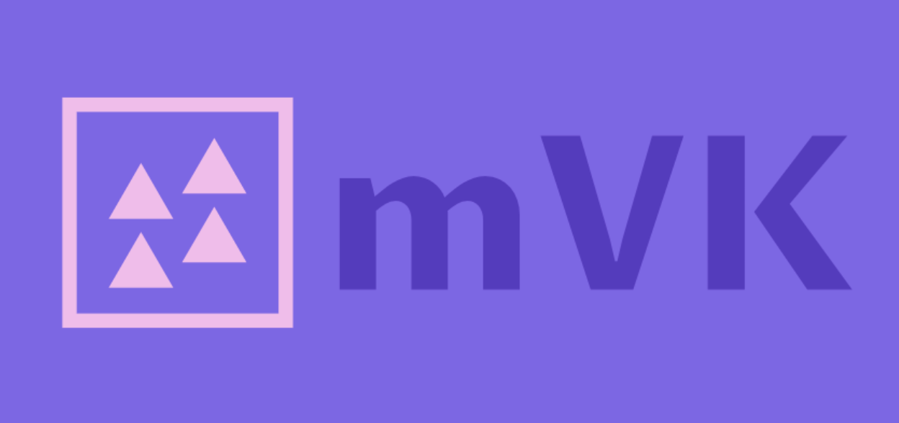

# Kanban project-solo



This was created during my time as a student at Code Chrysalis”.

This is the project to learn fullstack development.

## User Story
- as a software developer, I want to create kanban for task management
- as a software development team, we want to add post-its to Kanban, multiple members at the same time
- as a software development team, we want to be able to easily operate post-it from my smartphone when we all operate it.

## Mock Design


## Actual Design


## Architecture


## Setup

### Verified Environment
- node v12.x
- yarn 1.22.x

- Mac OSX Catalina (10.15.x)
- AWS Amplify

### Install dependencies
```
yarn install
```

### Compiles and hot-reloads for development
```
yarn serve
```

### Compiles and minifies for production
```
yarn build
```

### Lints and fixes files
```
yarn lint
```

## TODOs
- [x] Implement MVP
    - [x] Authentication
        - [x] Show Username
    - [ ] Basic Kanban Feature
        - [x] List Post-it
        - [x] Put Post-it
        - [x] Remove Post-it
        - [ ] Move Post-it
        - [ ] Create Kanban lane
        - [ ] Remove Kanban lane
    - [ ] Collaborative Kanban
        - [ ] Can see same Kanban
        - [ ] Can modify same Kanban
- [ ] Test
    - [ ] Unit
    - [ ] E2E
- [ ] Use CSS Pre-Poccessor
- [x] CI/CD
    - [x] Deploy Pipeline

## Ref
- [How to Create App with AWS Amplify](https://aws.amazon.com/jp/builders-flash/202008/amplify-crud-app/)
